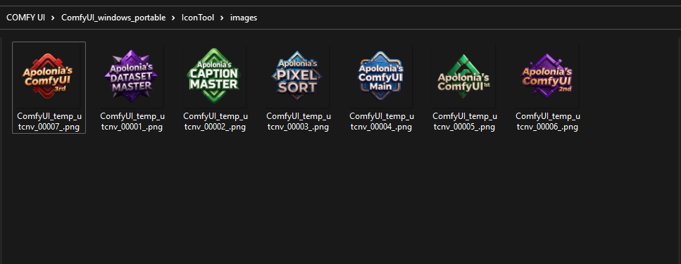
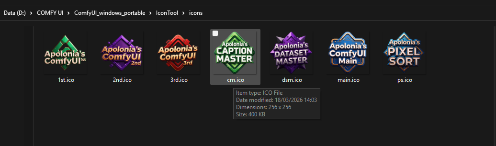
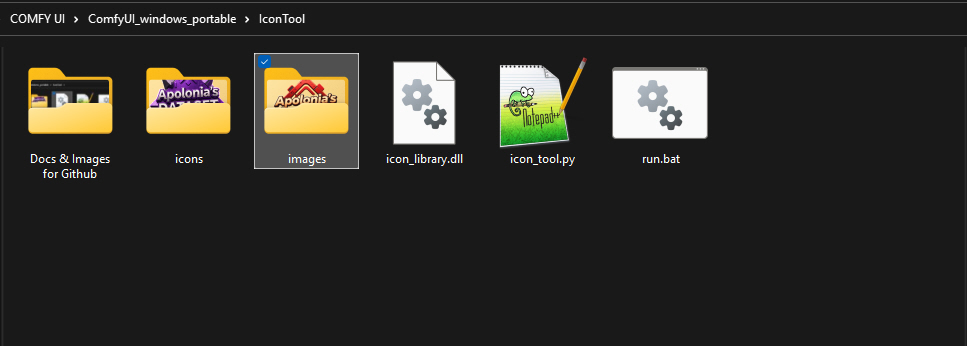
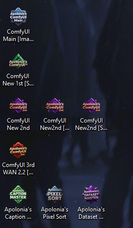

# IconTool

Convert AI-generated PNG images into Windows desktop icons and store them in a `.dll` file — no compiler, no external tools, pure Python.

Built for use with [ComfyUI](https://github.com/comfyanonymous/ComfyUI) but works with any PNG source images.

---

## What it does

1. **Converts** PNG images into multi-resolution `.ico` files (8 sizes: 16–256px)
 
2. **Packages** all icons into a single `icon_library.dll` resource file

3. **Applies** icons to any Windows folder or shortcut via the desktop [fastest recommended] or command line


The DLL is a standard Windows resource-only PE32+ binary — no C compiler required. It is built entirely in Python and is compatible with Windows' native **Change Icon** dialog, `LoadIcon()`, and all shell contexts.

---

## Requirements

- **Windows** (icon application requires Windows APIs)
- **Python 3.9+**
- **Pillow** — image processing
- **pywin32** — Windows shell integration (only needed for the `apply` command)

---

## Installation

Choose the option that matches your setup.

---

### Option A — System Python (most users)

If you have Python installed normally from [python.org](https://python.org):

**1. Check Python is installed:**
```
python --version
```
If this fails, download Python from https://python.org and install it. During installation, check **"Add Python to PATH"**.

**2. Install dependencies:**
```
pip install pillow pywin32
```

**3. Edit `run.bat`** — open it in Notepad and remove or comment out the `call pathtomain` line so it reads:
```bat
@echo off
cd /d "%~dp0"
python icon_tool.py build
pause
```

**4. Double-click `run.bat`** or run from a command prompt:
```
python icon_tool.py build
```

---

### Option B — ComfyUI portable (embedded Python, any install)

ComfyUI's Windows portable release ships with its own Python inside `python_embeded\`. It does not use your system Python. You need to point the script at that Python directly.

**1. Find your ComfyUI Python path.**
It will be something like:
```
D:\ComfyUI_windows_portable\python_embeded\python.exe
```

**2. Install dependencies using that exact Python:**
```
D:\ComfyUI_windows_portable\python_embeded\python.exe -m pip install pillow pywin32
```
Replace the path with your actual ComfyUI location.

**3. Edit `run.bat`** — replace the `call pathtomain` and `python` lines with the full path to your embedded Python:
```bat
@echo off
cd /d "%~dp0"
D:\ComfyUI_windows_portable\python_embeded\python.exe icon_tool.py build
pause
```

**4. Double-click `run.bat`** — done.

> You can also create a shortcut to `run.bat` and keep it anywhere.

---

### Option B2 — ComfyUI portable with a `pathtomain` helper (advanced)

If you use multiple ComfyUI installs and want to share one `run.bat` across all of them, you can create a `pathtomain.bat` helper that adds the embedded Python to your PATH. This is the setup used by the original author of this tool.

**1. Create `pathtomain.bat`** anywhere on your system (e.g. `C:\Tools\PathToMain.bat`):
```bat
@echo off
set PATH=D:\ComfyUI_windows_portable\python_embeded;%PATH%
set PATH=D:\ComfyUI_windows_portable\python_embeded\Scripts;%PATH%
```
Replace the path with your actual ComfyUI location.

**2. Add `C:\Tools` to your Windows PATH** so `pathtomain` can be called from anywhere:
- Open **Start** → search **"environment variables"**
- Click **Environment Variables**
- Under **System variables**, find **Path** → **Edit** → **New**
- Add `C:\Tools` (the folder containing your `pathtomain.bat`)
- Click OK on all dialogs
- Open a **new** command prompt for the change to take effect

**3. Install dependencies** (do this once):
```
pathtomain
pip install pillow pywin32
```

**4. The included `run.bat` works as-is** — it calls `pathtomain` automatically.

To support multiple ComfyUI installs, create one `PathTo*.bat` per install in your Tools folder, each pointing to a different `python_embeded` path.

---

### Option C — Virtual environment

Recommended if you want to keep dependencies isolated:

```bat
python -m venv venv
venv\Scripts\activate
pip install pillow pywin32
python icon_tool.py build
```

To use with `run.bat`, replace its contents with:
```bat
@echo off
cd /d "%~dp0"
call venv\Scripts\activate
python icon_tool.py build
pause
```

---

### Quick comparison

| Setup | edit run.bat? | install command |
|---|---|---|
| System Python | Remove `call pathtomain` | `pip install pillow pywin32` |
| ComfyUI portable (direct path) | Replace python path | `D:\...\python_embeded\python.exe -m pip install pillow pywin32` |
| ComfyUI portable (pathtomain helper) | No changes needed | `pathtomain` then `pip install pillow pywin32` |
| Virtual environment | Replace with venv activate | `pip install pillow pywin32` |

---

## Folder structure

```
IconTool/
    icon_tool.py        ← main script
    run.bat             ← one-click build (ComfyUI embedded Python)
    images/             ← created automatically
    your_image.png       
    another_image.png
    icons/              ← created automatically
        your_icon.ico
        another_icon.ico
    icon_library.dll    ← created automatically
```

---

## Usage

### Build — convert PNGs to ICO and package into DLL

```bash
python icon_tool.py build
```

Converts every `.png` in the current folder into a multi-resolution `.ico` file, then packages all icons into `icon_library.dll`.

### List — show all icons stored in the DLL

```bash
python icon_tool.py list
```

### Apply — apply an icon to a folder or shortcut

```bash
python icon_tool.py apply
```

You will be prompted to enter an icon number and drag/paste a folder path or `.lnk` shortcut path.

- **Folders** — writes a `desktop.ini` file instructing Windows Explorer to use the custom icon
- **Shortcuts (.lnk)** — updates the shortcut's icon location property directly

> After applying, right-click your desktop and choose **Refresh**, or press **F5** in Explorer.

---

## Applying icons manually (no command line)

You can also apply icons from the Windows right-click menu without using the `apply` command:

1. Right-click the shortcut → **Properties**
2. Click **Change Icon**
3. Click **Browse** and navigate to `icon_library.dll`
4. Select your icon → **OK** → **Apply** → **OK**

This is the recommended method for applying icons to desktop shortcuts.

---

## Icon image guidelines

For sharp icons at all display sizes, generate your source images with these settings:

| Setting | Recommendation |
|---|---|
| Resolution | 1024×1024px, square |
| Background | Plain solid color or simple gradient — no scenes or environments |
| Subject | Centered, filling 70–80% of the canvas |
| Style | Bold shapes, high contrast, no fine detail or small text |
| Format | PNG with transparency (RGBA) |

**ComfyUI prompt additions:**
```
plain black background, centered composition, close crop,
bold simple shapes, icon design, no background detail
```

**Negative prompt:**
```
background, scenery, forest, environment, multiple subjects,
small details, text, watermark, busy
```

Icons are displayed at 16–96px depending on context. Fine photographic detail will appear soft at small sizes — bold, simple, high-contrast images work best.

---

## ICO format details

Each `.ico` file produced contains 8 frames:

| Size | Format | Used for |
|---|---|---|
| 256×256 | BMP DIB | High-DPI displays, large icon view |
| 128×128 | BMP DIB | Large icon view |
| 96×96 | BMP DIB | Desktop icons (150% DPI) |
| 64×64 | BMP DIB | Desktop icons (125% DPI) |
| 48×48 | BMP DIB | Desktop icons (100% DPI) |
| 32×32 | BMP DIB | Taskbar, dialog boxes |
| 24×24 | BMP DIB | Taskbar (small) |
| 16×16 | BMP DIB | Explorer details view, menus |

All frames use BMP DIB format with a proper AND mask derived from the image's alpha channel, which ensures correct transparency rendering in all Windows shell contexts.

---

## DLL format details

`icon_library.dll` is a valid Windows PE32+ resource-only DLL containing:

- `RT_ICON` (type 3) — one entry per icon frame
- `RT_GROUP_ICON` (type 14) — one group entry per original icon

It is compatible with:
- Windows **Change Icon** dialog (right-click → Properties → Change Icon → Browse)
- `LoadLibraryEx` + `LoadIcon` / `LoadImage` (C/C++)
- `System.Drawing.Icon` (C# / .NET)
- `win32gui.LoadImage` (Python + pywin32)

Icons are stored largest-first (256px at index 0) so Windows always selects the highest quality frame available.

---

## Loading icons from the DLL in code

**C / C++**
```c
HMODULE dll  = LoadLibraryEx("icon_library.dll", NULL, LOAD_LIBRARY_AS_DATAFILE);
HICON   icon = LoadIcon(dll, MAKEINTRESOURCE(1));  // 1 = first icon
```

**C# / WPF**
```csharp
var icon = new System.Drawing.Icon("icon_library.dll", new Size(32, 32));
```

**Python (pywin32)**
```python
import win32api, win32con, win32gui
dll  = win32api.LoadLibraryEx("icon_library.dll", 0, win32con.LOAD_LIBRARY_AS_DATAFILE)
icon = win32gui.LoadImage(dll, 1, win32con.IMAGE_ICON, 32, 32, 0)
```

---

## Configuration

At the top of `icon_tool.py`:

```python
PNG_FOLDER  = "."                 # folder containing your PNG source images
ICON_FOLDER = "icons"             # where .ico files are saved
DLL_PATH    = "icon_library.dll"  # output DLL path
```

Change these paths if you want to keep your PNGs, ICOs, and DLL in separate locations.

---

## Troubleshooting

**Icon appears blurry on the desktop**
This is expected for photographic images at small sizes (48–96px). Regenerate your source image with a plain background and bold, simple shapes. See [Icon image guidelines](#icon-image-guidelines).

**"The file contains no icons" in Change Icon dialog**
Delete the old `icon_library.dll`, delete the `__pycache__` folder, and run `python icon_tool.py build` again with the latest `icon_tool.py`.

**`pathtomain` not recognised**
This command is specific to ComfyUI portable installs. If you are using system Python, remove the `call pathtomain` line from `run.bat` and install dependencies with `pip install pillow pywin32` directly.

**Icon does not update after applying**
Right-click your desktop → **Refresh**, or press **F5** in Explorer. If still not updated, open the shortcut's Properties → Change Icon → browse to the DLL again and reselect the icon.

**`ModuleNotFoundError: No module named 'win32com'`**
Run `pip install pywin32`. The `apply` command requires pywin32 for shortcut manipulation.

---

## Dependencies

| Package | Purpose | Required for |
|---|---|---|
| `pillow` | Image resizing and PNG encoding | `build` command |
| `pywin32` | Windows shell API, shortcut editing | `apply` command only |

The `build` command (PNG → ICO → DLL) runs on any Python 3.9+ with only Pillow installed. `pywin32` is only needed if you use `python icon_tool.py apply` to apply icons via the command line. Manual application through the Windows right-click menu requires no additional dependencies.

---

## License

MIT

---
# *Built with 💜 by Apolonia — to reclaim your time from the mundane.*
